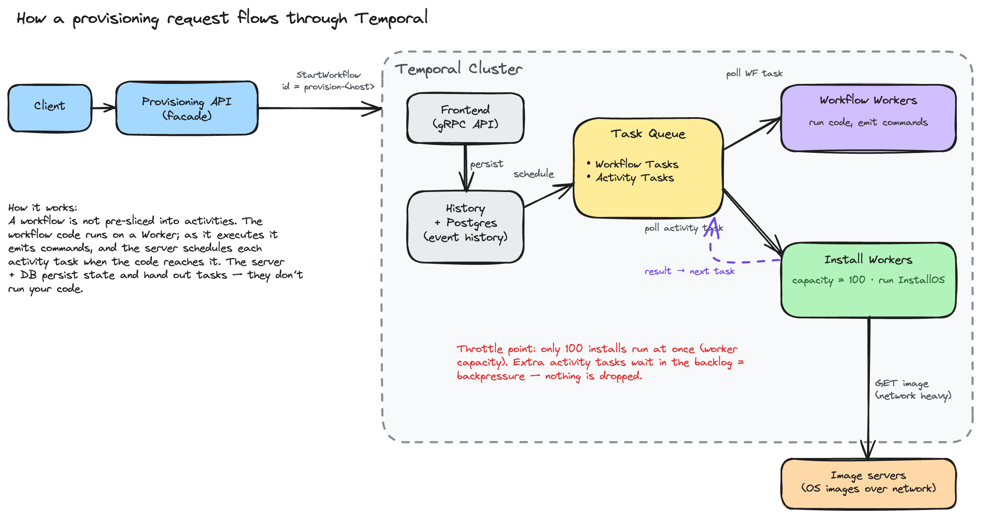

# The execution model, and common concurrency scenarios

The next level after [`writing-workflows.md`](writing-workflows.md): how work
actually flows through Temporal, and how to handle the concurrency and
reliability situations a team hits in production. Examples use team-a's
provisioning workflow.

## The working model we assume

For the rest of this document, assume the model the platform has settled on:
**provisioning is driven by an API, one host per call.**

- A caller hits the provisioning API once per machine. The API starts one
  Temporal workflow for that host and returns immediately.
- For 1000 machines, the API is called 1000 times — 1000 independent workflows.
- We do **not** know the total volume or the arrival rate in advance; requests
  can arrive in bursts.

Every scenario below builds on that. It matters because the throttling and
reliability tools you reach for depend on whether work is one big batch or, as
here, a stream of independent single-host workflows.

## The mental model

Understanding how a request becomes running work is the foundation for
everything else. This is the picture worth holding in your head:



Walking the flow:

1. The **API facade** takes a provision request and calls the Temporal
   **Frontend** — `StartWorkflow`, with the host ID as the workflow ID.
2. The Frontend **persists** the workflow's first event to the database and
   returns. The request is now durable; it will run even if everything
   downstream is busy.
3. The server puts a **Workflow Task** on a **task queue**. A **Workflow Worker**
   polls the queue, runs your workflow code, and — as the code executes — emits
   **commands** ("schedule the InstallOS activity").
4. Each scheduled activity becomes an **Activity Task** on a task queue. An
   **Install Worker** polls it, runs the real work (calling the image servers),
   and reports the result back.
5. The result is persisted, the server schedules the next Workflow Task, the
   worker resumes your code, and the loop repeats until the workflow completes.

Two points worth getting straight:

- **A workflow is not pre-sliced into activities.** Your workflow code *runs* on
  a worker, and it schedules each activity when the code reaches it. The server
  and database don't run your code — they persist state and hand out tasks.
- **The task queue is a durable buffer, not a fire-hose.** Tasks wait there until
  a worker has capacity. That buffering is exactly what lets you throttle work
  without losing it (Scenario 1), and what makes a workflow's state survive a
  crash (Scenario 2).

Three facts fall out of this model and drive the scenarios below:

- Starting a workflow is cheap and durable — you can accept a huge burst.
- Work only runs when a worker pulls it, so **worker capacity is your throttle**.
- Every step is written to history, so **state is durable for free** and failed
  steps can simply be retried.

---

## Scenario 1 — a burst of requests

*"A flood of provision calls just arrived. How do I keep from exhausting the
Temporal cluster and the image servers (network bandwidth for OS images)?"*

The instinct is to rate-limit the API. Don't. Starting a workflow is cheap and
durable, so **accept every request** and throttle the step that actually stresses
your resources — the install.

**Accept and dedupe at the API.** Each call starts one per-host workflow and
returns. Use the host ID as the workflow ID so retries don't double-provision:

```go
c.ExecuteWorkflow(ctx, client.StartWorkflowOptions{
    ID:                       "provision-" + hostID,   // one workflow per host
    TaskQueue:                "provisioning-tq",
    WorkflowIDConflictPolicy: enums.WORKFLOW_ID_CONFLICT_POLICY_USE_EXISTING, // idempotent
}, ProvisionMachineWorkflow, hostID)
```

`USE_EXISTING` makes a duplicate call for an in-flight host attach to the running
workflow instead of erroring — so the API is retry-safe and never has to reject.

**Throttle the install, not the API.** Run `InstallOS` on a dedicated install
task queue whose worker fleet has a fixed total capacity — say 100. However many
workflows are open, only 100 installs run at once; the rest wait in the task
queue backlog and start as slots free. That backlog *is* your backpressure —
nothing is dropped. The knobs, all on the install worker:

| `worker.Options` field | Controls | Default |
|---|---|---|
| `MaxConcurrentActivityExecutionSize` | Activities running at once **per pod** | 1000 |
| `MaxConcurrentActivityTaskPollers` | Poller goroutines per pod | 2 |
| `WorkerActivitiesPerSecond` | Activity start rate **per pod** | 100000 (∞) |
| `TaskQueueActivitiesPerSecond` | Activity start rate across the **whole queue** (all pods) | 100000 (∞) |

- **To cap concurrency** (protect the image servers from too many *parallel*
  transfers): size the fleet so `MaxConcurrentActivityExecutionSize` × replicas =
  100. The worker simply stops pulling at the limit.
- **To cap rate** (protect network *bandwidth* — new transfers started per
  second): set `TaskQueueActivitiesPerSecond`. This is the knob for "don't kick
  off more than N image downloads a second," enforced across all pods.
- **Do not set a tight `ScheduleToStartTimeout`** on the throttled activity.
  Waiting in the backlog is the healthy state here; that timeout would fail
  installs that are correctly queued. Instead watch the queue's **backlog depth**
  and **schedule-to-start latency** — a sustained rise is the signal to add
  install workers.

**Why this protects Temporal too:** you're never scheduling 1000 activities at
once, so persistence load and history growth stay bounded. The platform also caps
each namespace server-side (per-namespace requests/sec and DB queries/sec), so a
runaway team can't overwhelm the shared cluster — your knobs tune throughput up to
that ceiling (see the research repo's `multi-tenancy-setup.md`).

**The single-batch shortcut.** If instead you *do* have one job that owns all
1000 hosts (not the API model), run it as a single workflow and bound the fan-out
with a semaphore — because a semaphore is scoped to one execution, its limit is
then the global limit for that job:

```go
sem := workflow.NewSemaphore(ctx, 100)
wg := workflow.NewWaitGroup(ctx)
for _, m := range machines {
    m := m
    _ = sem.Acquire(ctx, 1)          // blocks once 100 are in flight
    wg.Add(1)
    workflow.Go(ctx, func(ctx workflow.Context) {
        defer wg.Done(); defer sem.Release(1)
        _ = workflow.ExecuteChildWorkflow(ctx, ProvisionMachineWorkflow, m).Get(ctx, nil)
    })
}
wg.Wait(ctx)
```

Watch the scope: a semaphore caps **one workflow execution**. In the API model
each host is its own execution, so ten in-flight workflows would each get their
own 100 — no global cap. That's why the API model throttles at the worker/queue
(above). If you need a hard global cap independent of fleet size, run a
**gatekeeper workflow**: one long-lived workflow holding 100 permits that each
host workflow signals to acquire before installing and release after (continue-as-new
periodically; use lease timeouts so a crashed holder's permit is reclaimed).

---

## Scenario 2 — persisting state during a workflow

*"My workflow builds up state as it runs, and an install takes two hours. If a
worker dies, do I lose that progress?"*

Mostly, Temporal persists state for you — with one thing you manage yourself
inside long activities.

**Workflow state is durable automatically.** The variables in your workflow
function (which hosts are done, the allocation result, a running count) are
reconstructed by replaying the event history. You write ordinary Go; every
activity result and every step is already in history, so if the worker crashes,
another worker replays and continues with the same state. You never write
persistence code for workflow state, and you must not reach for a database inside
the workflow — history *is* the database.

**Activity progress needs a checkpoint, because a retry restarts the activity.**
If the 2-hour install dies at 90%, its retry starts from zero unless you record
progress. Use **heartbeat details**: whatever you pass to `RecordHeartbeat` is
handed back to the next attempt.

```go
func InstallOSAllNodes(ctx context.Context, nodes []string) error {
    start := 0
    if activity.HasHeartbeatDetails(ctx) {   // a previous attempt got partway
        var done int
        _ = activity.GetHeartbeatDetails(ctx, &done)
        start = done                          // resume where it failed
    }
    for i := start; i < len(nodes); i++ {
        installOne(nodes[i])                  // itself idempotent (Scenario 3)
        activity.RecordHeartbeat(ctx, i+1)    // checkpoint: i+1 done
    }
    return nil
}
```

**Two levels of checkpoint — pick the granularity:**

- *Across activities (free):* split a long job into several activities. Each
  completed activity is in history, so a workflow retry never re-runs a finished
  one. Reach for this first.
- *Within one activity:* heartbeat details, as above, when a single step is long
  and you don't want to split it.

**Very long or high-volume workflows:** history isn't infinite (tens of thousands
of events is the practical ceiling). A workflow that loops forever or fans out to
huge numbers should call `workflow.NewContinueAsNewError` to start a fresh
execution with a compact state, keeping history small.

---

## Scenario 3 — retrying on failure

*"Installs fail — a flaky network, an image server 503, a worker pod that gets
killed, and sometimes a bug in my own code. What does Temporal retry, and what do
I have to handle?"*

Temporal retries a lot for you; your job is to make retries safe and to fail fast
on the errors retrying can't fix.

**What retries automatically:**

- **Activity errors** (the flaky network, the 503) — Temporal re-runs the
  activity per its retry policy. Defaults if you set nothing: `InitialInterval`
  1s, `BackoffCoefficient` 2.0, `MaximumInterval` 100× initial,
  `MaximumAttempts` 0 (unlimited). Set `MaximumAttempts` to bound it.
- **Worker crashes** — if the pod running an activity dies, the activity task
  goes back on the queue and another worker picks it up. For a long install, set
  a short `HeartbeatTimeout` so this is detected in minutes, not after the full
  `StartToCloseTimeout`:

  ```go
  ctx = workflow.WithActivityOptions(ctx, workflow.ActivityOptions{
      StartToCloseTimeout: 3 * time.Hour,   // covers the ~2h install
      HeartbeatTimeout:    2 * time.Minute, // dead worker detected in ~2m
      RetryPolicy:         &temporal.RetryPolicy{MaximumAttempts: 5},
  })
  ```

- **Workflow-code (workflow task) failures** — a panic or a bug in workflow code
  fails the *workflow task*, not the workflow. Temporal keeps retrying the task,
  so the workflow *pauses* rather than dying. Fix and redeploy the worker and it
  picks up where it left off. This is why a bad deploy wedges workflows instead of
  losing them.

**What you must handle:**

- **Idempotency.** Because activities can run more than once, their side effects
  must be safe to repeat. Derive a stable idempotency key from values that don't
  change across retries (the workflow ID is stable) and pass it to downstream
  systems so a repeated "create host" is a no-op. `activity.GetInfo(ctx).Attempt`
  tells you which attempt you're on.
- **Fail fast on errors retrying can't fix.** A malformed request or a
  deterministic code bug won't get better on attempt five. Return a
  non-retryable error (`temporal.NewNonRetryableApplicationError(...)`, or list
  `NonRetryableErrorTypes` in the policy) so Temporal stops immediately instead of
  burning attempts.
- **Determinism, for workflow code.** A retry of workflow code is a *replay*, so
  the code must be deterministic — no clocks, randomness, or network calls in the
  workflow (those go in activities). A non-deterministic change to a running
  workflow's code is the one failure that can wedge it; guard it with a replay
  test and version incompatible changes (see
  [`writing-workflows.md`](writing-workflows.md#writing-tests)).

**Re-running after a fix: reset.** Once you've fixed a bug, rewind a workflow to
an earlier point and replay forward with the new code, instead of starting over:

```bash
temporal workflow reset -n team-a --workflow-id provision-host-42 \
  --type LastWorkflowTask --reason "fixed InstallOS bug"
```
