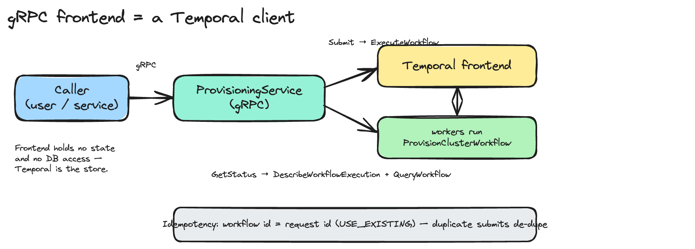

# A gRPC API frontend for Temporal

> **For workflow developers** — expose a workflow over a gRPC API using a Temporal Client.

A worked example of the standard Temporal entry-point pattern: a Go gRPC + Proto
service that fronts the `compute-provisioning` `ProvisionClusterWorkflow`. It
exposes two RPCs — submit a provisioning request, and get its status with detailed
step messages — and it's meant to be copied as the starting point for your own
frontend over any workflow.

Code: [`examples/api-frontend/`](../examples/api-frontend). Tested live against the
GKE + Cloud SQL cluster; results are at the end.

## Mental model: a frontend is just a Temporal client

The thing your users or upstream services call is a plain gRPC service. Behind
each RPC, the handler is a **Temporal client** making one or two calls. There is
no business logic in the frontend and no state — Temporal holds the state, and
the workers do the work. The frontend never touches the database.

Two moves cover almost every frontend:

- **Submit** → `client.ExecuteWorkflow(...)` starts a workflow (or re-attaches to a
  running one) and returns immediately with identifiers. The actual provisioning
  runs asynchronously on the workers.
- **Get status** → `client.DescribeWorkflowExecution(...)` for the overall state,
  plus `client.QueryWorkflow(...)` for the detailed, in-flight progress.



The frontend knows the backend only by **contract**: the workflow type name
(`ProvisionClusterWorkflow`), the task queue (`provisioning-tq`), the input shape,
and the query name + shape. It does **not** import the worker package. That
decoupling is why you can stand up a frontend for any workflow the same way.

## The two RPCs

From [`proto/provisioning/v1/provisioning.proto`](../examples/api-frontend/proto/provisioning/v1/provisioning.proto):

```proto
service ProvisioningService {
  rpc SubmitProvisioningRequest(SubmitProvisioningRequestRequest) returns (SubmitProvisioningRequestResponse);
  rpc GetProvisioningStatus(GetProvisioningStatusRequest) returns (GetProvisioningStatusResponse);
}
```

- **Submit** takes `request_id` (idempotency key), `cluster_name`, `node_count`; returns the `request_id` (= workflow id) and `run_id`.
- **GetStatus** takes `request_id`; returns `state`, `current_step`, `messages[]`, and — once terminal — `result` or `error_message`.

## How the detailed status works (the query)

Overall state (`RUNNING`/`COMPLETED`/`FAILED`/…) comes straight from
`DescribeWorkflowExecution`. The **step-by-step messages** come from a Temporal
**Query** — a synchronous, side-effect-free call into the workflow that returns
whatever the workflow chooses to publish. The workflow registers a handler and
keeps a snapshot up to date as it runs:

```go
status := &ProvisioningStatus{CurrentStep: "starting"}
workflow.SetQueryHandler(ctx, "provisioningStatus", func() (ProvisioningStatus, error) {
    return *status, nil
})
// ... update status.CurrentStep / status.Messages before and after each activity
```

Two things worth knowing:

- **Exposing progress is the workflow's job.** Adding a frontend usually means
  adding a query handler to the workflow — which is exactly what this example did
  to `ProvisionClusterWorkflow`.
- **Queries work on closed workflows too** (within the namespace retention) — the
  server replays history to answer them — so `GetStatus` keeps working after the
  workflow completes.

## Idempotency

The **workflow id is the idempotency key.** The service uses `request_id` (or
derives `provision-<cluster_name>` when it's empty) and starts the workflow with
`WorkflowIDConflictPolicy = USE_EXISTING`. A duplicate submit while a run is in
flight re-attaches to that run instead of starting a second one. Use a stable,
unique key — an asset serial, an order id — so client retries de-duplicate to a
single workflow.

## Project layout

```
examples/api-frontend/
  proto/provisioning/v1/provisioning.proto   # the contract
  buf.yaml, buf.gen.yaml                      # codegen config
  gen/provisioning/v1/*.pb.go                 # generated stubs (committed)
  internal/service/service.go                 # RPCs → Temporal client calls
  internal/service/service_test.go            # unit tests (SDK mocks)
  cmd/server/main.go                          # gRPC server + reflection + health
  cmd/apiclient/main.go                       # polling CLI client (for testing)
  deploy/api-frontend.yaml                    # k8s Deployment + Service
  Dockerfile
```

## Build your own, 0 → 1

1. **Define the proto** — your service and its request/response messages.
2. **Generate stubs** with `buf` (a pure-Go compiler; no `protoc` needed):
   ```bash
   go install github.com/bufbuild/buf/cmd/buf@latest
   go install google.golang.org/protobuf/cmd/protoc-gen-go@latest
   go install google.golang.org/grpc/cmd/protoc-gen-go-grpc@latest
   cd examples/api-frontend && PATH="$PATH:$(go env GOPATH)/bin" buf generate
   ```
3. **Implement the service** — hold a `client.Client`; map each RPC to
   `ExecuteWorkflow` / `DescribeWorkflowExecution` / `QueryWorkflow`. Match the
   workflow's input and query structs by their JSON field names (that is the
   contract; you don't import the worker).
4. **If you need progress detail, add a query handler to the workflow** and update
   its snapshot as it runs.
5. **Wire `main`** — `client.Dial` from env, register the service on a gRPC server,
   turn on reflection + health.
6. **Test** with the SDK's testify mocks (`go.temporal.io/sdk/mocks`).
7. **Containerize + deploy.**

## Build + test locally

```bash
cd examples/api-frontend
go test ./...     # unit tests
go build ./...
# run against any reachable Temporal frontend:
TEMPORAL_ADDRESS=localhost:7233 TEMPORAL_NAMESPACE=compute-provisioning go run ./cmd/server
```

## Deploy to the GKE cluster

The frontend is a Temporal client — no database, no Cloud SQL proxy, no Workload
Identity. Build for amd64, push to Artifact Registry, and apply the manifest.

```bash
export PROJECT=gke-poc-498602 REGION=us-central1
REPO="${REGION}-docker.pkg.dev/${PROJECT}/app"

# the workflow must expose the provisioningStatus query, so rebuild + roll the worker too
docker build --platform linux/amd64 --build-arg TEAM=compute-provisioning -t $REPO/temporal-worker-compute-provisioning:query workers/
docker push $REPO/temporal-worker-compute-provisioning:query
kubectl -n temporal set image deploy/worker-compute-provisioning worker=$REPO/temporal-worker-compute-provisioning:query

# the frontend
docker build --platform linux/amd64 -t $REPO/temporal-api-frontend:dev examples/api-frontend/
docker push $REPO/temporal-api-frontend:dev
sed "s|__AR_REPO__|${REPO}|" examples/api-frontend/deploy/api-frontend.yaml | kubectl -n temporal apply -f -
kubectl -n temporal rollout status deploy/temporal-api-frontend
```

## Call it

```bash
kubectl -n temporal port-forward svc/temporal-api-frontend 9233:9233 &

# the bundled client: submit, then poll until terminal
cd examples/api-frontend
go run ./cmd/apiclient -addr localhost:9233 -cluster edge-42 -nodes 3

# or grpcurl (server reflection is enabled)
grpcurl -plaintext localhost:9233 list
grpcurl -plaintext -d '{"cluster_name":"edge-42","node_count":3}' \
  localhost:9233 provisioning.v1.ProvisioningService/SubmitProvisioningRequest
grpcurl -plaintext -d '{"request_id":"provision-edge-42"}' \
  localhost:9233 provisioning.v1.ProvisioningService/GetProvisioningStatus
```

## Testing results (validated against dev-fop + Cloud SQL, 2026-07-09)

**Unit tests** — 6/6 pass (`go test ./...`):
`TestSubmit_Success`, `TestSubmit_DerivesWorkflowID`, `TestSubmit_Validation`
(no cluster name / zero nodes), `TestGetStatus_Running`, `TestGetStatus_Completed`,
`TestGetStatus_NotFound`. They use the SDK's `mocks.Client` plus a small fake
`EncodedValue`, so they assert the RPC→client mapping with no live server.

**Real end-to-end** — the frontend deployed in GKE, called from a laptop over a
port-forward. Submit returns immediately; `GetStatus` streams the workflow's query
detail until it completes:

```text
$ go run ./cmd/apiclient -addr localhost:9233 -cluster edge-api-42 -nodes 3 -request-id demo-edge-api-42
submitted: request_id=demo-edge-api-42 run_id=019f4d29-4e61-7086-aff2-7de821758c31
  · allocating bare-metal assets
  ·   3 server(s) reserved
  · installing OS on nodes
  ·   ubuntu-22.04 installed on edge-api-42-node-1
  ·   ubuntu-22.04 installed on edge-api-42-node-2
  ·   ubuntu-22.04 installed on edge-api-42-node-3
  · configuring network
  ·   network configured
  · installing kubernetes
  ·   kubernetes installed
  · verifying cluster
  ·   all nodes Ready
state=STATE_COMPLETED current_step="completed"
result: cluster "edge-api-42" provisioned on 3 node(s): all nodes Ready
```

This exercises the whole path: laptop → gRPC → frontend pod (GKE) → Temporal
frontend → `ProvisionClusterWorkflow` → the `provisioningStatus` query. The run is
also visible in the Web UI under the `compute-provisioning` namespace.

**Idempotency** — two submits with the same `request_id`, fired concurrently while
a run was in flight, returned the **same** `run_id` (the second re-attached rather
than starting a duplicate):

```text
submit A: run_id=019f4d2a-3f31-7995-a7f0-f967f3446882
submit B: run_id=019f4d2a-3f31-7995-a7f0-f967f3446882   → same run ✓
```

## Production notes

- **Security:** this demo serves plaintext gRPC. In production put mTLS and
  authentication (OIDC/JWT) on the endpoint, and if the Temporal cluster enforces
  authz, carry the caller's identity through to the right namespace.
- **Ingress:** expose it with an internal, gRPC-capable load balancer or gateway —
  `port-forward` is for testing only.
- **Deadlines:** set gRPC deadlines. `Submit` is fast (it returns as soon as the
  workflow is started); `GetStatus` is a Describe + a Query.
- **Don't block a request on a running workflow.** `client.GetWorkflow().Get()`
  blocks until completion — this service calls it only on terminal states to fetch
  the result. For "wait for the result" semantics, poll `GetStatus` from the client
  (as `apiclient` does) instead.
