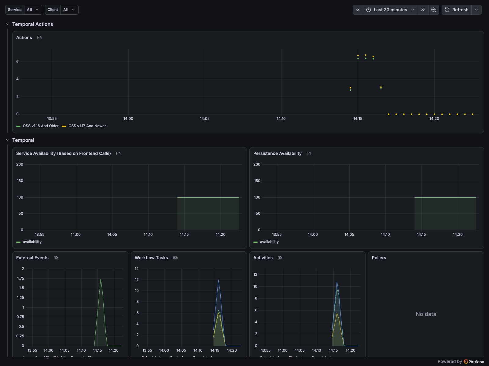
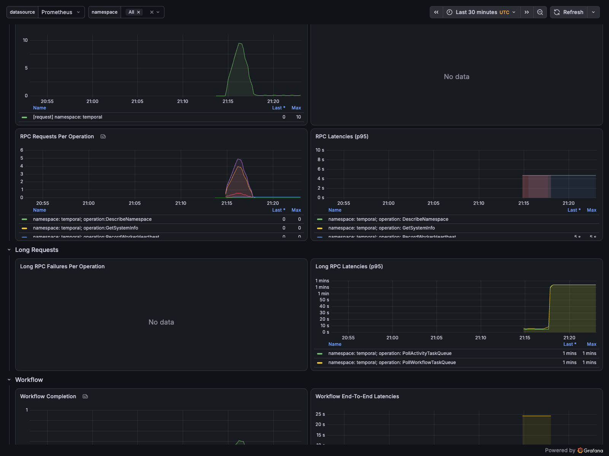
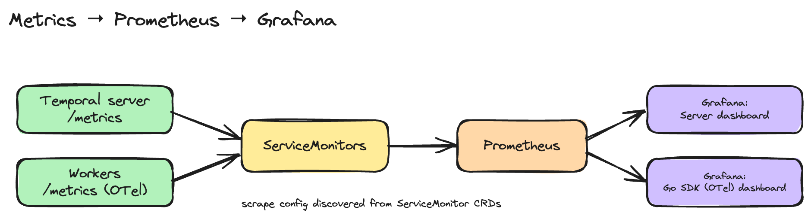

# Metrics and dashboards

Temporal's Web UI inspects individual workflows; metrics and dashboards come from
Prometheus + Grafana. This project ships both, with two dashboards that work out
of the box:

- **Temporal Server Metrics** — cluster/internal health (request rates, latencies,
  persistence, shards) and per-namespace `workflow_success` / `workflow_failed`.
- **Temporal Go SDK (OTel) Metrics** — per-team, per-workflow-type execution
  metrics: end-to-end and activity latency, failures, schedule-to-start latency,
  worker task-slot usage.

## What the dashboards look like

Captured from the local setup below after running ~110 workflows across compute-provisioning and
team-b.

**Temporal Server Metrics** — actions, service/persistence availability, and
workflow-task / activity throughput:



**Temporal Go SDK (OTel) Metrics** — request rates and latencies from the workers,
including the long-poll (PollWorkflowTaskQueue / PollActivityTaskQueue) latencies
and the per-workflow execution panels:



## Where the metrics come from



| Metrics | Source | Scraped via |
|---|---|---|
| Server / internal | Each Temporal service exposes Prometheus metrics on port 9090 | Temporal chart's **ServiceMonitor** (`server.metrics.serviceMonitor.enabled`) |
| SDK / workflow-execution | The worker emits them — the shared client wires the OpenTelemetry metrics handler + Prometheus exporter and serves `/metrics` when `TEMPORAL_METRICS_ADDR` is set (see [`workers/internal/temporalclient/metrics.go`](../workers/internal/temporalclient/metrics.go)) | A **ServiceMonitor** over the worker Services |

The SDK metrics use OpenTelemetry naming (`temporal_*_total`, `temporal_*_seconds_bucket`), which is what the official [temporalio/dashboards](https://github.com/temporalio/dashboards) SDK dashboard queries — so the dashboard populates without editing. SDK metrics require the workers to run **in-cluster** (so a ServiceMonitor can reach them); the host-run workers in the runbook's quick path are not scraped.

## Local (Rancher Desktop)

Bundle the whole stack. Assumes the base cluster is already up (runbook Layers 1–3).

```bash
CTX="--context rancher-desktop"

# 1. Monitoring stack (Prometheus Operator + Prometheus + Grafana), trimmed for a laptop
helm install monitoring prometheus-community/kube-prometheus-stack \
  -n monitoring --create-namespace \
  -f deploy/local/monitoring/kube-prometheus-stack-values.yaml

# 2. Turn on the Temporal server ServiceMonitor (CRD now exists)
helm upgrade temporal temporal/temporal -n temporal \
  -f deploy/local/20-temporal-values.yaml \
  -f deploy/local/monitoring/temporal-metrics-values.yaml

# 3. Workers in-cluster (so their SDK metrics can be scraped)
docker build --build-arg TEAM=compute-provisioning -t temporal-worker-compute-provisioning:dev workers/
docker build --build-arg TEAM=team-b -t temporal-worker-team-b:dev workers/
kubectl $CTX apply -f deploy/local/40-workers.yaml

# 4. Load the dashboards (Grafana's sidecar picks up ConfigMaps labelled grafana_dashboard=1)
for d in server-general:temporal-server-general sdk:temporal-sdk-go-otel; do
  name="temporal-dash-${d%%:*}"; file="${d##*:}"
  kubectl $CTX -n monitoring create configmap "$name" \
    --from-file="$file.json=deploy/local/monitoring/dashboards/$file.json" \
    -o yaml --dry-run=client | kubectl $CTX apply -f -
  kubectl $CTX -n monitoring label configmap "$name" grafana_dashboard=1 --overwrite
done
```

Open Grafana (admin / admin) and find the two Temporal dashboards:

```bash
kubectl --context rancher-desktop -n monitoring port-forward svc/monitoring-grafana 3000:80
# http://localhost:3000  →  Dashboards → "Temporal Server Metrics", "Temporal Go SDK (OTel) Metrics"
```

Quick checks that the pipeline is live:

```bash
kubectl --context rancher-desktop -n monitoring \
  port-forward svc/monitoring-kube-prometheus-prometheus 9090:9090
# http://localhost:9090/targets  →  temporal-* services + worker-compute-provisioning/b all UP
# query: sum(workflow_success)                                (server metrics)
# query: sum(temporal_workflow_endtoend_latency_seconds_count) (SDK metrics)
```

## Production (GKE)

A shared GKE cluster almost always already runs Prometheus + Grafana (or Google
Cloud Managed Service for Prometheus). So **don't** install kube-prometheus-stack.
Ship only the portable pieces and point the existing stack at them:

- **ServiceMonitors** — enable the Temporal server ServiceMonitor
  (`server.metrics.serviceMonitor.enabled: true` in the GKE values) and apply the
  worker ServiceMonitor (as in `deploy/local/40-workers.yaml`, minus the
  `imagePullPolicy: Never` — workers are real registry images from CI). Make sure
  your Prometheus's `serviceMonitorSelector` matches their labels.
- **Dashboards** — load the two JSON files in `deploy/local/monitoring/dashboards/`
  into your Grafana the way your platform provisions dashboards (sidecar
  ConfigMaps, Grafana Operator, or the API). They're standard Grafana dashboards.
- If the cluster has no Grafana/Prometheus at all, the local stack values are a
  starting point — size Prometheus retention/storage for real load and enable
  persistence.

See [`deploy/gcp/`](../deploy/gcp/) for how the shared environments are run.

## Files

```
deploy/local/monitoring/
  kube-prometheus-stack-values.yaml   # local Prometheus + Grafana (trimmed)
  temporal-metrics-values.yaml        # Temporal overlay: enable server ServiceMonitor
  dashboards/
    temporal-server-general.json      # official server dashboard
    temporal-sdk-go-otel.json         # official Go SDK (OTel) dashboard
deploy/local/40-workers.yaml          # in-cluster workers + metrics Service + ServiceMonitor
```
