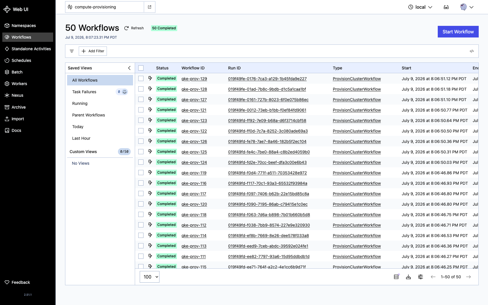
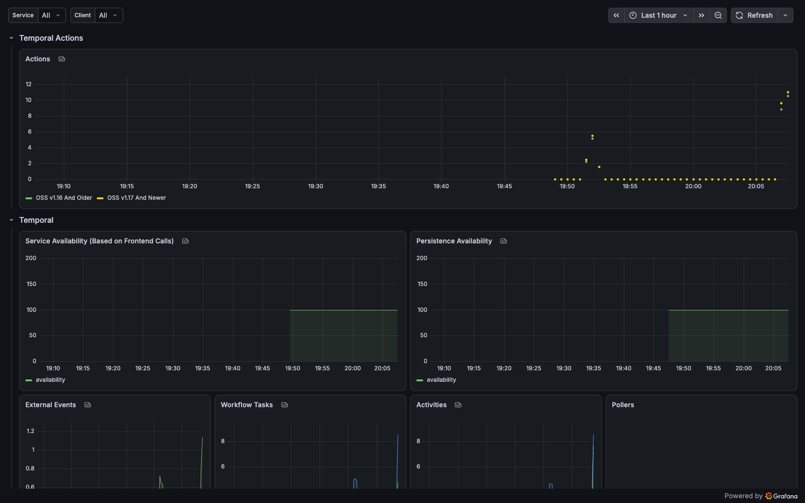
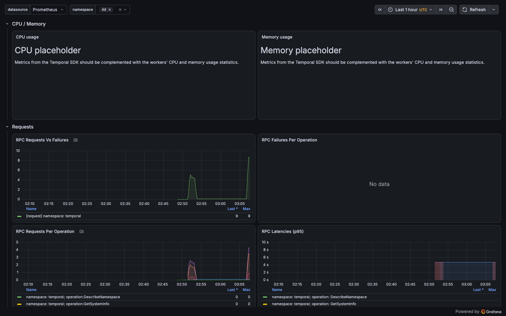

# Runbook: shared Temporal on GKE + Cloud SQL

Stand up the shared Temporal platform on a hardened GKE cluster with Google
Cloud SQL for PostgreSQL as the state store, using **IAM database
authentication** — no stored password anywhere. The GKE cluster and the Cloud
SQL instance are built by the `iac-gke` cluster factory; Temporal is deployed on
top from this repo. Follow it top to bottom.

At the end you have the `dev-fop` cluster running Temporal (server + Web UI)
against a private-IP Cloud SQL instance, workers pulled from Artifact Registry,
metrics in Grafana, and workflows executing — then a clean teardown.

> **Validated** on 2026-07-09 against project `gke-poc-498602` (region
> `us-central1`). Results are recorded in the last section.

## How the database connection works (the important part)

Only the **Temporal server** touches the database. Each server pod runs a **Cloud
SQL Auth Proxy as a native sidecar**: the proxy authenticates to Cloud SQL as the
pod's Workload Identity (`--auto-iam-authn`) and exposes PostgreSQL on
`127.0.0.1:5432`. Temporal connects there as the IAM database user **with an
empty password** — the proxy injects a short-lived OAuth token as the credential.
Workers never connect to the database; they reach the frontend over gRPC.

So the secretless chain is: KSA `temporal` → (Workload Identity) → GSA
`temporal-sql@` → (`roles/cloudsql.instanceUser` + `client`) → Cloud SQL IAM user.

## Prerequisites

- **gcloud** authenticated (`gcloud auth login` + `gcloud auth application-default login`) with rights on the project, and **`gke-gcloud-auth-plugin`** installed. The nodes are private, but the control plane exposes a public endpoint; `get-credentials` wires `kubectl` to it and the plugin mints a short-lived Google OAuth token for each call.
- **kubectl**, **helm** v3.8+ (tested on v4), **docker**, and the **temporal** CLI.
- The **`iac-gke`** repo checked out (the cluster factory).
- Convenience vars used below:
  ```bash
  export PROJECT=gke-poc-498602 REGION=us-central1
  export INST=dev-fop-temporal-<suffix>                    # from `gcloud sql instances list`
  export CONN="${PROJECT}:${REGION}:${INST}"
  export GSA="temporal-sql@${PROJECT}.iam.gserviceaccount.com"
  export DB_IAM_USER="temporal-sql@${PROJECT}.iam"          # the GSA email minus ".gserviceaccount.com"
  export REPO="${REGION}-docker.pkg.dev/${PROJECT}/app"     # Artifact Registry (created by fop)
  ```

## Layer 1 — build the cluster + Cloud SQL (iac-gke pipeline)

Cloud SQL is opt-in per purpose; `fop` turns it on (`config/clusters.yaml`:
`enable_cloud_sql: true`, ADR-0010). Apply only through the gated pipeline —
never `terraform apply` from a laptop.

```bash
# one-time: the automation SA needs the two Cloud SQL build roles
gcloud projects add-iam-policy-binding "$PROJECT" \
  --member="serviceAccount:cluster-ctrl-automation@${PROJECT}.iam.gserviceaccount.com" \
  --role=roles/cloudsql.admin --condition=None
gcloud projects add-iam-policy-binding "$PROJECT" \
  --member="serviceAccount:cluster-ctrl-automation@${PROJECT}.iam.gserviceaccount.com" \
  --role=roles/servicenetworking.networksAdmin --condition=None

# build (from the iac-gke repo). foundation first (enables sqladmin + servicenetworking),
# then fop (VPC + PSA + cluster + Cloud SQL + Artifact Registry). Each run gates on
# the dev GitHub Environment — approve it in the GitHub UI (or via the API).
gh workflow run terraform-apply.yml -f env=dev -f purpose=foundation
gh workflow run terraform-apply.yml -f env=dev -f purpose=fop
gh run watch <run-id> --exit-status
```

> Cloud SQL for `POSTGRES_16` defaults to the `ENTERPRISE_PLUS` edition, which
> rejects small `db-custom-*` tiers. The `cloud-sql` module pins
> `edition = ENTERPRISE` so the dev `db-custom-1-3840` tier is accepted (iac-gke
> commit `22ae5c2`). The cluster create can also flake on a transient
> `gkecommonwebhooks ... DEADLINE_EXCEEDED` health-check timeout; if it does,
> delete the `ERROR` cluster and re-run the apply.

**Validate:**
```bash
gcloud container clusters list --project $PROJECT          # dev-fop RUNNING
gcloud sql instances describe $INST --project $PROJECT \
  --format="value(state, settings.edition, settings.ipConfiguration.ipv4Enabled, ipAddresses[0].type, connectionName)"
  # RUNNABLE  ENTERPRISE  False  PRIVATE  <project>:<region>:<instance>
gcloud sql databases list --instance $INST --project $PROJECT   # temporal, temporal_visibility
```

## Layer 2 — connect to the cluster

```bash
gcloud container clusters get-credentials dev-fop --region $REGION --project $PROJECT
kubectl get nodes    # nodes Ready (kubectl talks to the control-plane public endpoint)
```

## Layer 3 — Temporal identity + IAM database auth

```bash
kubectl create namespace temporal

# 1. a service account for Temporal's DB access
gcloud iam service-accounts create temporal-sql --project $PROJECT \
  --display-name="Temporal Cloud SQL (IAM DB auth)"
# (the grants can race SA propagation by a few seconds — just retry if they 400)
gcloud projects add-iam-policy-binding "$PROJECT" --member="serviceAccount:${GSA}" --role=roles/cloudsql.client --condition=None
gcloud projects add-iam-policy-binding "$PROJECT" --member="serviceAccount:${GSA}" --role=roles/cloudsql.instanceUser --condition=None

# 2. the IAM database user — created WITHOUT the ".gserviceaccount.com" suffix
gcloud sql users create "$DB_IAM_USER" --instance=$INST --project $PROJECT \
  --type=cloud_iam_service_account

# 3. pre-create the KSA the chart will use, annotate + Workload-Identity-bind it.
#    (Pre-created — not chart-created — so the schema Job can run under it before install.)
kubectl create serviceaccount temporal -n temporal
kubectl annotate serviceaccount temporal -n temporal iam.gke.io/gcp-service-account=$GSA --overwrite
gcloud iam service-accounts add-iam-policy-binding "$GSA" --project $PROJECT \
  --role=roles/iam.workloadIdentityUser \
  --member="serviceAccount:${PROJECT}.svc.id.goog[temporal/temporal]"
```

## Layer 4 — grant the IAM user schema privileges (one-time bootstrap)

The two databases exist but are owned by `cloudsqlsuperuser`. On PostgreSQL 15+,
a non-owner cannot create objects in the `public` schema, so the IAM user needs a
one-time `GRANT` — done from a transient `postgres` session (a superuser). This
password is used only for this bootstrap; Temporal never sees it, and the
instance is torn down at the end.

```bash
PGPW="$(openssl rand -base64 24)"
gcloud sql users set-password postgres --instance=$INST --project $PROJECT --password="$PGPW"
kubectl -n temporal create secret generic pg-bootstrap --from-literal=password="$PGPW"

cat <<YAML | kubectl -n temporal apply -f -
apiVersion: batch/v1
kind: Job
metadata: { name: temporal-db-grant }
spec:
  backoffLimit: 1
  template:
    spec:
      restartPolicy: Never
      serviceAccountName: temporal
      initContainers:
        - name: cloud-sql-proxy
          image: gcr.io/cloud-sql-connectors/cloud-sql-proxy:2.14.1
          restartPolicy: Always
          args: ["--private-ip","--address=127.0.0.1","--port=5432","${CONN}"]
          securityContext: { runAsNonRoot: true, allowPrivilegeEscalation: false }
      containers:
        - name: grant
          image: postgres:16-alpine
          env:
            - { name: PGPASSWORD, valueFrom: { secretKeyRef: { name: pg-bootstrap, key: password } } }
          command: ["/bin/sh","-ec"]
          args:
            - |
              for db in temporal temporal_visibility; do
                psql "host=127.0.0.1 port=5432 user=postgres dbname=\$db sslmode=disable" -v ON_ERROR_STOP=1 \
                  -c "GRANT ALL ON SCHEMA public TO \"${DB_IAM_USER}\";" \
                  -c "GRANT ALL ON DATABASE \"\$db\" TO \"${DB_IAM_USER}\";"
              done
              echo "grants complete"
YAML
kubectl -n temporal wait --for=condition=complete job/temporal-db-grant --timeout=120s
kubectl -n temporal delete secret pg-bootstrap job/temporal-db-grant   # clean up the transient password
```

## Layer 5 — schema (one-off Job with the Auth Proxy)

The chart's own schema Job can't carry the proxy, so run schema setup as a
controlled one-off Job ([`deploy/gcp/schema-job.yaml`](../deploy/gcp/schema-job.yaml))
that pairs `temporal-sql-tool` with the proxy sidecar under the `temporal` KSA.
It sets up and versions both databases as the IAM user (now that it has the
grant).

```bash
sed -e "s|__CLOUD_SQL_CONNECTION_NAME__|${CONN}|" -e "s|__TEMPORAL_DB_IAM_USER__|${DB_IAM_USER}|" \
    deploy/gcp/schema-job.yaml | kubectl -n temporal apply -f -
kubectl -n temporal wait --for=condition=complete job/temporal-schema --timeout=180s
kubectl -n temporal logs job/temporal-schema -c schema | tail -1   # "schema setup complete"
```

## Layer 6 — metrics stack (install before Temporal)

Temporal's values enable a `ServiceMonitor`, whose CRD is provided by
kube-prometheus-stack — so the metrics stack must be installed **first**, or the
Temporal install fails with "no matches for kind ServiceMonitor".

```bash
helm repo add prometheus-community https://prometheus-community.github.io/helm-charts && helm repo update
helm install monitoring prometheus-community/kube-prometheus-stack -n monitoring --create-namespace \
  -f deploy/local/monitoring/kube-prometheus-stack-values.yaml
kubectl get crd servicemonitors.monitoring.coreos.com   # exists now

# load the two Temporal dashboards (Grafana's sidecar auto-imports ConfigMaps labelled grafana_dashboard=1)
for f in temporal-server-general temporal-sdk-go-otel; do
  kubectl -n monitoring create configmap "$f" --from-file="$f.json=deploy/local/monitoring/dashboards/$f.json"
  kubectl -n monitoring label configmap "$f" grafana_dashboard=1 --overwrite
done
```

On a real shared GKE you would instead point the cluster's existing Prometheus /
Google Managed Prometheus at the ServiceMonitors — see [`observability.md`](observability.md).

## Layer 7 — deploy Temporal

Fill the placeholders in [`deploy/gcp/gke-values.yaml`](../deploy/gcp/gke-values.yaml)
and install. Pin the chart version so the server matches the schema
(chart `1.5.0` = server `1.31.1`).

```bash
sed -e "s|__CLOUD_SQL_CONNECTION_NAME__|${CONN}|" \
    -e "s|__TEMPORAL_DB_IAM_USER__|${DB_IAM_USER}|" \
    deploy/gcp/gke-values.yaml > /tmp/gke-values.rendered.yaml

helm repo add temporal https://go.temporal.io/helm-charts && helm repo update temporal
helm install temporal temporal/temporal --version 1.5.0 -n temporal -f /tmp/gke-values.rendered.yaml
for d in frontend history matching worker web; do kubectl -n temporal rollout status deploy/temporal-$d --timeout=180s; done
```

> The chart (1.5.0) has no switch to skip its own schema Job, and that Job has no
> proxy so it can't reach Cloud SQL. `gke-values.yaml` sets `schema.useHelmHooks:
> false` (so it doesn't block the server pods) and `schema.backoffLimit: 0` (so it
> fails once and stops). That one failed `temporal-schema-*` Job is expected —
> ignore it; our Layer 5 Job is the real one.

Create the team namespaces and check health (via the admintools pod, no
port-forward needed):

```bash
AT=$(kubectl -n temporal get pod -l app.kubernetes.io/component=admintools -o name | head -1)
ADDR=temporal-frontend.temporal.svc:7233
kubectl -n temporal exec $AT -- temporal operator cluster health --address $ADDR         # SERVING
kubectl -n temporal exec $AT -- temporal operator namespace create --address $ADDR --retention 72h compute-provisioning
kubectl -n temporal exec $AT -- temporal operator namespace create --address $ADDR --retention 72h team-b
```

## Layer 8 — workers (from Artifact Registry)

Workers reach the frontend over gRPC and need no DB access. GKE nodes are amd64,
so build for that platform (the Dockerfile cross-compiles).

```bash
gcloud auth configure-docker ${REGION}-docker.pkg.dev --quiet
docker build --platform linux/amd64 --build-arg TEAM=compute-provisioning -t $REPO/temporal-worker-compute-provisioning:dev workers/
docker build --platform linux/amd64 --build-arg TEAM=team-b -t $REPO/temporal-worker-team-b:dev workers/
docker push $REPO/temporal-worker-compute-provisioning:dev && docker push $REPO/temporal-worker-team-b:dev

sed "s|__AR_REPO__|${REPO}|" deploy/gcp/workers.yaml | kubectl -n temporal apply -f -
kubectl -n temporal get pods -l temporal-worker=true    # both Running
```

## Layer 9 — verify end-to-end

```bash
AT=$(kubectl -n temporal get pod -l app.kubernetes.io/component=admintools -o name | head -1)
ADDR=temporal-frontend.temporal.svc:7233
for i in $(seq 1 20); do
  kubectl -n temporal exec $AT -- temporal workflow start --address $ADDR -n compute-provisioning \
    --task-queue provisioning-tq --type ProvisionClusterWorkflow --workflow-id gke-prov-$i --input '{"clusterName":"edge-'$i'","nodeCount":2}'
  kubectl -n temporal exec $AT -- temporal workflow start --address $ADDR -n team-b \
    --task-queue orders-tq --type OrderWorkflow --workflow-id gke-ord-$i --input '{"orderId":"O-'$i'","amount":10}'
done
kubectl -n temporal exec $AT -- temporal workflow list --address $ADDR -n compute-provisioning   # Completed
```

Checklist:
- [ ] `dev-fop` RUNNING; Cloud SQL RUNNABLE with a **private IP** and `cloudsql.iam_authentication=on`.
- [ ] Temporal `SERVING`; schema present in both Cloud SQL databases; all server pods `2/2` (server + proxy).
- [ ] Workflows across both namespaces reach `Completed`.
- [ ] Prometheus targets for the server + both workers are `up`; Grafana shows the server + SDK dashboards with data (`temporal_workflow_completed`).
- [ ] **No database password exists** — `kubectl -n temporal get secret temporal-default-store -o jsonpath='{.data.password}' | base64 -d` is empty; the server connects via the proxy as the IAM user.

## Accessing the Web UI and Grafana

Both are private ClusterIP services on a private cluster — there is no public URL.
Reach them from your workstation by tunnelling over your cluster credentials with
`kubectl port-forward`. Credentials are already set from Layer 2; in a fresh shell,
re-run `gcloud container clusters get-credentials dev-fop --region $REGION --project $PROJECT` first.

**Temporal Web UI** — in one terminal:
```bash
kubectl -n temporal port-forward svc/temporal-web 8080:8080
# → http://localhost:8080   (namespaces compute-provisioning and team-b under Workflows)
```

**Grafana** — in a second terminal:
```bash
kubectl -n monitoring port-forward svc/monitoring-grafana 3000:80
# → http://localhost:3000
# login: admin / (fetch the password)
kubectl -n monitoring get secret monitoring-grafana -o jsonpath='{.data.admin-password}' | base64 -d; echo
```
The two dashboards are "Temporal Server Metrics" and "Temporal Go SDK (OTel) Metrics".

Notes:
- `port-forward` runs in the foreground — keep each in its own tab, or append `&` to
  background it. Stop with Ctrl-C.
- If a local port is busy, change the left number (e.g. `9080:8080`) and use that port.
- The tunnel drops if the pod restarts; just re-run the command.

## Teardown

```bash
helm uninstall temporal -n temporal
helm uninstall monitoring -n monitoring
kubectl delete namespace temporal monitoring
gcloud sql users delete "$DB_IAM_USER" --instance=$INST --project $PROJECT --quiet
gcloud iam service-accounts delete "$GSA" --project $PROJECT --quiet
# destroy the cluster + Cloud SQL via the pipeline (from iac-gke); confirm=fop is the safety echo
gh workflow run terraform-destroy.yml -f env=dev -f purpose=fop -f confirm=fop
```

## Validated (dev, gke-poc-498602, 2026-07-09)

Deployed on the `dev-fop` cluster (node pool autoscaled 3→4 under load) against
Cloud SQL `dev-fop-temporal-fe83`. IAM database auth worked end-to-end: the schema
Job and all four server services connected to Cloud SQL through the proxy sidecar
as `temporal-sql@…iam` with **no password**. 100 workflows across the two team
namespaces all reached `Completed`, and both Grafana dashboards show live data.

### Validation evidence

```console
$ # 1. Cloud SQL — private IP + IAM auth
RUNNABLE  ENTERPRISE  False  10.43.0.3  PRIVATE

$ # 2. Temporal cluster health
SERVING

$ # 3. Server pods (2/2 = server + Cloud SQL proxy sidecar)
temporal-frontend-675bd586f7-hss5n  2/2  Running
temporal-history-8c665d98f-k9k8t    2/2  Running
temporal-matching-f8446b6db-t2l4c   2/2  Running
temporal-web-564597588c-lgcck       1/1  Running
temporal-worker-6469d8dd59-4qc2g    2/2  Running
worker-compute-provisioning-...     1/1  Running
worker-team-b-...                   1/1  Running

$ # 4. Workflows Completed per namespace
compute-provisioning   Total: 50
team-b                 Total: 50

$ # 5. No DB password — chart store secrets are empty
temporal-default-store    password="" (length 0)
temporal-visibility-store password="" (length 0)
```

All six Prometheus scrape targets (4 server services + 2 workers) reported `up`,
and the server metric `temporal_workflow_completed` tracked the workflow count.

### Screenshots

Temporal Web UI — `compute-provisioning` namespace, 50/50 `Completed`
(`ProvisionClusterWorkflow`):



Grafana — **Temporal Server Metrics** (Actions, service/persistence availability,
workflow tasks, activities), fed by the server `ServiceMonitor`:



Grafana — **Temporal Go SDK (OTel) Metrics** (RPC requests vs failures, per-operation
requests, p95 latencies), fed by the workers' OTel metrics:


